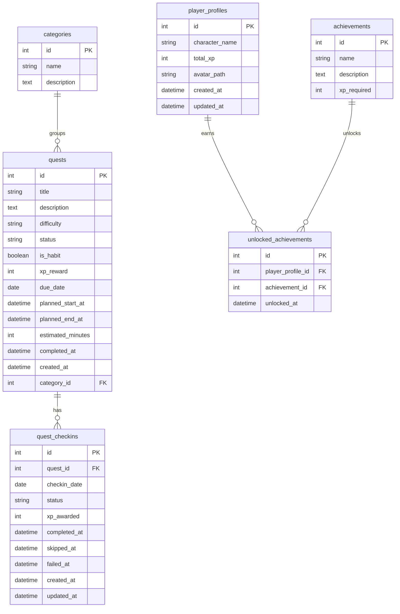

# Habit Quest Analytics

An RPG-inspired habit planner and analytics dashboard that turns scheduled tasks
into daily quests, awards XP for completed quest days, and shows progress through
operational metrics, trend analysis, and character growth.


## Table of Contents

- [Project Goal](#project-goal)
- [My Role](#my-role)
- [Live Demo](#live-demo)
- [Project Status](#project-status)
- [Preview](#preview)
- [Tech Stack](#tech-stack)
- [What It Does](#what-it-does)
- [Example Insights](#example-insights)
- [Features](#features)
- [App Sections](#app-sections)
- [Key Technical Decisions](#key-technical-decisions)
- [Data Flow](#data-flow)
- [Architecture](#architecture)
- [Data Model](#data-model)
- [Requirements](#requirements)
- [Installation](#installation)
- [Running The App](#running-the-app)
- [Tests](#tests)
- [Design Principles](#design-principles)
- [Limitations & Future Work](#limitations--future-work)

## Project Goal

Habit apps often track whether tasks were done, but they do not always connect
planning, completion, XP, progression, and analytics in one workflow.

Habit Quest Analytics explores that loop as a portfolio MVP. It lets a user
schedule daily quests, mark each quest day as planned, completed, skipped, or
failed, earn XP from completed check-ins, grow RPG-style stats, and review
behavior through dashboards and charts.

## My Role

I designed and implemented the current MVP, including:

- SQLAlchemy data model and SQLite persistence.
- Streamlit app shell, custom navigation, and dark RPG dashboard UI.
- Quest planning workflow with calendar scheduling.
- Monthly Checklist tracking system backed by daily `QuestCheckin` records.
- Checklist status service with idempotent XP rules.
- Command Center, Habit Analytics, and Character Profile data services.
- RPG XP, level, and stat progression logic.
- Pytest coverage for models, services, metrics, and migration behavior.
- Project documentation and roadmap.

## Live Demo

Live app: https://habit-quest-analytics-sai5h3bl7wjykw4fbruabd.streamlit.app

This is a public portfolio demo deployed on Streamlit Community Cloud. The
project is local-first and currently uses SQLite for local/demo persistence. It
is not a production multi-user SaaS app. Local uploaded files and local SQLite
data are not production-grade persistent storage on Streamlit Cloud and may reset
after redeploys, reboots, or instance changes.

## Project Status

The MVP is functional and deployed.

Implemented:

- Home Base onboarding hub.
- Custom Streamlit navigation/sidebar with explicit page labels.
- Calendar-based Quest Planner.
- Monthly Checklist UI for daily quest/checkin tracking.
- Recurring Habit templates with explicit selected-month planned-day generation.
- `QuestCheckin` model for per-day completion status.
- Checklist service for `Planned`, `Completed`, `Skipped`, `Failed`, reset
  behavior, XP idempotency, and a stale planned failure helper.
- Scheduled quest creation that creates a planned check-in for the scheduled
  date.
- Command Center operational metrics powered by check-ins.
- Character Profile XP, level, completed quest days, and RPG stats powered by
  check-in XP.
- Habit Analytics weekly pulse, trend, breakdown, consistency, planned workload,
  and insight data powered by check-ins.
- Legacy `Quest.status` compatibility/fallback while the migration remains
  stable.

Still evolving:

- Recurring habit editing and true N-times-per-week scheduling.
- Production persistence.
- Authentication and user-specific data.
- External calendar sync.
- AI and voice planning assistants.
- Optional automatic stale planned failure workflow.
- Eventual cleanup of legacy `Quest.status` once the check-in migration is fully
  stable.

## Preview

No screenshot files are currently committed. Use the live demo above to review
the current UI.

## Tech Stack

- Python
- Streamlit
- SQLite
- SQLAlchemy
- Pandas
- Plotly
- streamlit-calendar
- pytest
- Streamlit Community Cloud

## What It Does

Habit Quest Analytics turns productivity tracking into a compact RPG loop:

- Schedule quests on a calendar.
- Track daily completion in a Monthly Checklist.
- Complete quest days to earn XP.
- Grow RPG stats through quest categories.
- Review today's operational status in Command Center.
- Analyze consistency, trends, status mix, category activity, and planned
  workload in Habit Analytics.
- View level, XP progress, avatar, radar chart, and RPG stats in Character
  Profile.

## Example Insights

The app is designed to answer questions such as:

- Which habits or quest categories are completed most consistently?
- Which categories generate the most XP?
- Which weekdays are strongest or weakest?
- How much planned time is assigned by category?
- How many quest days were completed, failed, skipped, or still planned?
- Which RPG stats grow from completed quest days?

## Features

### Quest Planning

- Calendar-based scheduled quest creation.
- Title, category, difficulty, start time, end time, and notes.
- XP reward calculation from planned time.
- Estimated duration calculation from the scheduled time window.
- Calendar and selected day schedule views that display check-in status.
- Recurring Habit templates for Every day, Weekdays, and custom selected
  weekdays.
- Explicit selected-month generation for recurring planned quest days.
- Recurring habits can be all-day or use a planned start/end time window.

### Monthly Checklist

- Month and year selection.
- Matrix preview with quests as rows and days as columns.
- Recurring habits appear as one logical row with generated dates populated.
- Status legend for empty, planned, completed, skipped, and failed days.
- Compact status editor for selected quest/date actions.
- Complete, Skip, Fail, and Reset actions.
- `QuestCheckin.xp_awarded` prevents duplicate XP from repeated completion
  actions.

### Command Center

- Read-only operational overview for today's quest check-ins.
- Planned Today, Completed Today, Failed, and Overdue metrics from
  `QuestCheckin`.
- Today's Focus list using parent quest details and daily check-in status.

### Habit Analytics

- Weekly XP from check-in XP.
- Completed and failed quest days for the current week.
- Weekly completion rate using completed / (completed + failed).
- XP trend by check-in date.
- Check-ins by status and category.
- Completion rate by weekday.
- Planned minutes by category.
- Insight summaries based on completed and failed check-ins.

### Character Profile

- Avatar upload stored locally for the demo profile.
- Total XP from `QuestCheckin.xp_awarded`.
- Level, XP to next level, and level progress.
- Completed Quest Days count.
- RPG stat XP from completed check-ins joined to quest categories.
- Radar chart for stat balance.

### Navigation / UI

- Explicit Streamlit navigation using polished page labels.
- Dark RPG dashboard theme.
- Tile-like sidebar navigation styling.
- Card-based sections and compact helper text.

### Testing

- Pytest coverage for XP rules, metrics, model relationships, check-in
  constraints, checklist services, quest creation integration, analytics
  services, and profile calculations.
- Compile check used before code handoff.

## App Sections

- `Home Base` - onboarding, app explanation, quick start, app map, and
  local-first MVP note.
- `Command Center` - read-only operational overview powered by daily quest
  check-ins.
- `Quest Planner` - calendar planner, selected day schedule, new quest form,
  Recurring Habits, and Monthly Checklist.
- `Habit Analytics` - weekly pulse, XP trends, check-in breakdowns, consistency
  charts, planned minutes, and insights.
- `Character Profile` - avatar, XP, level, completed quest days, RPG stats, and
  radar chart.

## Key Technical Decisions

- `QuestCheckin` is the source of truth for daily completion status when
  check-ins exist.
- `Quest.status` remains in the model for compatibility/fallback during
  migration.
- XP is stored in `QuestCheckin.xp_awarded` so historical XP values are
  preserved and repeated completion does not duplicate XP.
- Scheduled quests create a planned check-in for the scheduled date.
- Business logic lives in service layers instead of Streamlit page code.
- Metrics are covered by pytest before the UI consumes them.
- Auto-fail service logic exists with `grace_days = 3`, but it is not
  automatically enabled from app startup or page load.
- The app remains local-first until production persistence is explicitly
  designed.

## Data Flow

```text
Scheduled Quest
  -> Planned QuestCheckin
  -> Monthly Checklist status update
  -> Command Center operational metrics
  -> Character Profile XP/progression
  -> Habit Analytics trends and consistency
```

Streamlit pages are presentation surfaces. Services prepare workflow and
analytics data. SQLAlchemy models own persistence. Tests cover the behavior that
should remain stable as the UI evolves.

## Architecture

```text
habit-quest-analytics/
  app/
    main.py                  # Streamlit entrypoint, Home Base, explicit navigation
    pages/                   # Command Center, Quest Planner, Habit Analytics, Character Profile
  src/
    analysis/                # Pure metric helpers
    database/                # SQLAlchemy models, SQLite engine, startup schema helpers, seed data
    services/                # Quest, checklist, analytics, profile, and XP business logic
    constants.py             # Statuses, difficulties, categories, RPG stat mapping
    ui.py                    # Shared Streamlit UI/style helpers
  docs/                      # Project, model, metrics, and design documentation
  tests/                     # Pytest coverage
  data/                      # Local SQLite database and local uploads
```

## Data Model

Core entities:

- `Category` - groups quests into areas such as Health, Work, Learning, Home,
  and Social.
- `Quest` - scheduled task or habit plan with difficulty, XP reward, due date,
  optional time window, and legacy status.
- `QuestCheckin` - daily status record for one quest on one date.
- `PlayerProfile` - local character profile name, avatar path, and legacy total
  XP field.
- `Achievement` - planned milestone definition.
- `UnlockedAchievement` - join table connecting profiles to unlocked
  achievements.

Important relationship:

- One `Quest` can have many `QuestCheckin` records.
- A `QuestCheckin` tracks the status for a specific `quest_id` and
  `checkin_date`.
- `QuestCheckin.xp_awarded` is used for XP, progression, RPG stats, and
  analytics when check-ins exist.



See [docs/data_model.md](docs/data_model.md) for deeper model notes.

## Requirements

- Python 3.11, as specified in `runtime.txt`.
- Dependencies from `requirements.txt`:
  - Streamlit
  - SQLAlchemy
  - pandas
  - Plotly
  - streamlit-calendar
  - pytest
- SQLite database at `data/habit_quest.db` by default.

## Installation

```bash
git clone https://github.com/BaseMar/habit-quest-analytics.git
cd habit-quest-analytics
python -m venv .venv
.venv\Scripts\activate
pip install -r requirements.txt
```

## Running The App

```bash
streamlit run app/main.py
```

In VS Code, you can also open `run_streamlit.py` and click **Run Python File**.
That launcher runs the same Streamlit command from the project root.

The app initializes SQLite tables and default categories on startup. Default
categories can also be seeded manually:

```bash
python -m src.database.seed
```

## Tests

```bash
python -m pytest
python -m compileall -q app src tests
```

On Windows, if local pycache permissions cause compile issues, run with a
temporary pycache prefix:

```powershell
$env:PYTHONPYCACHEPREFIX="$env:TEMP\habit_quest_pycache"
python -m compileall -q app src tests
```

## Design Principles

- Daily completion tracking belongs to `QuestCheckin`.
- UI pages should read prepared service data instead of owning business rules.
- Service functions own status transitions, XP idempotency, and query
  preparation.
- XP changes must be idempotent.
- Analytics should avoid double-counting legacy quest status and check-in
  records.
- Future work should stay small, testable, and local-first until production
  persistence is planned.

## Limitations & Future Work

Current limitations:

- Recurring Habits v1 supports selected weekdays and explicit month generation;
  true N-times-per-week auto-scheduling is not implemented yet.
- XP System v2 uses planned time for new scheduled quest and recurring habit XP,
  plus nonlinear character leveling. Stat-level UI is still planned. See
  [docs/xp_system_v2_design.md](docs/xp_system_v2_design.md).
- SQLite/local file storage is suitable for MVP and demo use, not production
  multi-user persistence.
- Authentication and user-specific data isolation are not implemented.
- Google Calendar sync is not implemented.
- AI planning assistant and voice quest capture are not implemented.
- Auto-fail exists as service logic but is not automatically enabled.
- `Quest.status` still exists for compatibility/fallback and should be cleaned
  up only after the check-in migration is stable.

Suggested future order:

1. XP System v2
2. Recurring habit editing and N-times-per-week scheduling
3. PostgreSQL / production persistence
4. Authentication
5. Google Calendar sync
6. AI planning assistant
7. Voice quest capture / microphone input
8. Optional auto-fail activation workflow
9. Legacy `Quest.status` cleanup
