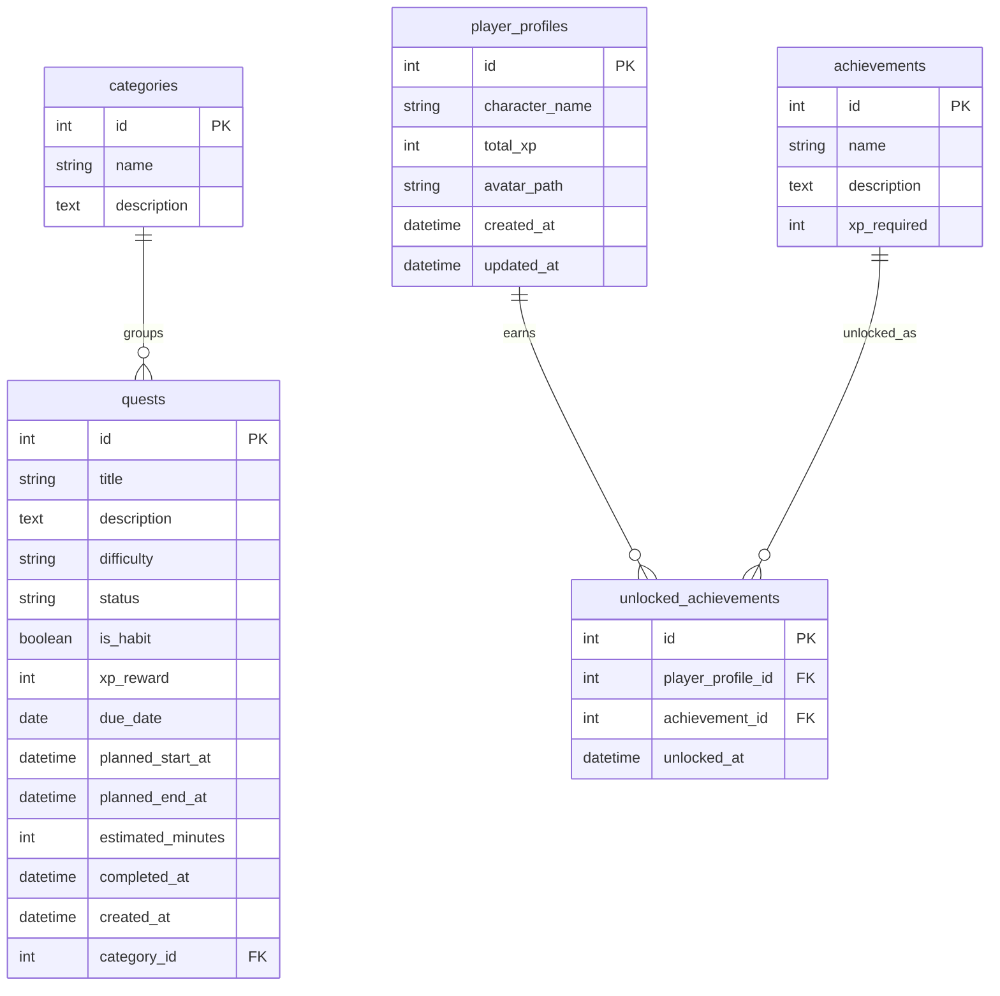

# Data Model

Habit Quest Analytics uses SQLite locally through SQLAlchemy. The current model set is intentionally small so the MVP can be built without database complexity.

## Tables

### categories

Stores labels used to group quests.

| Field | Purpose |
| --- | --- |
| `id` | Primary key. |
| `name` | Unique category name, such as Health, Work, Learning, Home, or Social. |
| `description` | Optional explanation of what belongs in the category. |

Relationships:

- One category can have many quests.

### quests

Stores tasks and habits represented as quests.

| Field | Purpose |
| --- | --- |
| `id` | Primary key. |
| `title` | Quest name shown to the user. |
| `description` | Optional quest details. |
| `difficulty` | Difficulty label used for XP rewards. |
| `status` | Quest state, currently expected to start as `Planned`. |
| `is_habit` | Marks whether the quest represents a habit rather than a one-time task. |
| `xp_reward` | XP value assigned to the quest. |
| `due_date` | Optional planned date kept for compatibility with existing analytics. |
| `planned_start_at` | Optional scheduled start datetime for calendar planning. |
| `planned_end_at` | Optional scheduled end datetime for calendar planning. |
| `estimated_minutes` | Optional planned duration in minutes. |
| `completed_at` | Timestamp set when the quest is completed. |
| `created_at` | Timestamp set when the quest is created. |
| `category_id` | Optional foreign key to `categories.id`. |

Relationships:

- Many quests can belong to one category.

### player_profiles

Stores the user's RPG-style character profile.

| Field | Purpose |
| --- | --- |
| `id` | Primary key. |
| `character_name` | Display name for the character. |
| `total_xp` | Total XP earned across completed quests. |
| `avatar_path` | Optional local path to the uploaded character avatar image. |
| `created_at` | Timestamp set when the profile is created. |
| `updated_at` | Timestamp updated when the profile changes. |

Relationships:

- One player profile can have many unlocked achievements.

### achievements

Stores achievement definitions.

| Field | Purpose |
| --- | --- |
| `id` | Primary key. |
| `name` | Unique achievement name. |
| `description` | Optional explanation of the achievement. |
| `xp_required` | XP threshold associated with the achievement. |

Relationships:

- One achievement can be unlocked by many profiles through `unlocked_achievements`.

### unlocked_achievements

Links player profiles to achievements they have unlocked.

| Field | Purpose |
| --- | --- |
| `id` | Primary key. |
| `player_profile_id` | Foreign key to `player_profiles.id`. |
| `achievement_id` | Foreign key to `achievements.id`. |
| `unlocked_at` | Timestamp set when the achievement is unlocked. |

Relationships:

- Many unlocked achievement records belong to one player profile.
- Many unlocked achievement records point to one achievement.
- The pair `player_profile_id` and `achievement_id` is unique.

## Mermaid ERD

## Notes For Future Development

- Planned vs actual time analysis will require an actual-time field; `estimated_minutes` already exists.
- Recurring habits may need a separate completion history table.
- Achievement rules may need fields beyond `xp_required` once non-XP achievements are added.
- Database migrations are not included yet; schema changes should be made carefully while the project is still small.
- Local avatar uploads are stored under `data/uploads/` and are intentionally ignored by git.
- Local avatar storage is suitable for the local-first MVP and demos. On Streamlit Community Cloud, files stored locally may be lost after reboot, redeploy, or instance reset; durable production persistence would require external storage or a production database later.
