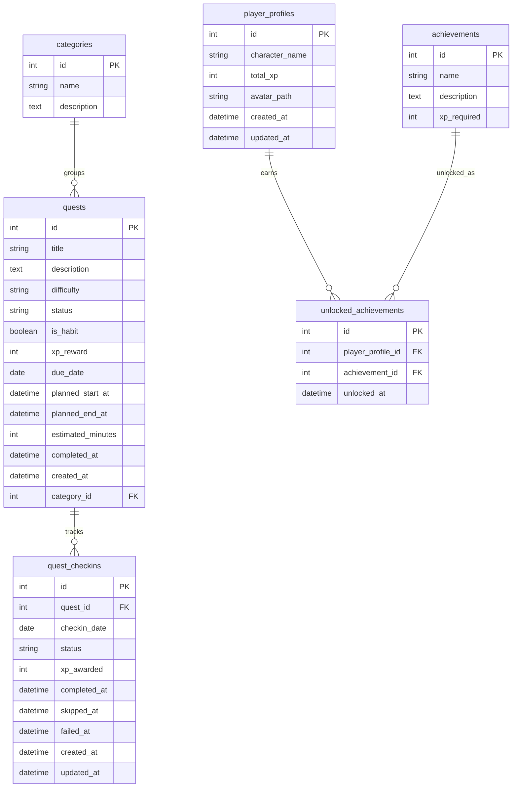

# Data Model

Habit Quest Analytics uses SQLite locally through SQLAlchemy. The model remains intentionally small, but daily status tracking now belongs to `QuestCheckin` rather than only to `Quest.status`.

## Source Of Truth

`QuestCheckin` is the main source of truth for daily completion/status/progression when check-ins exist.

- `Quest.status` still exists for legacy compatibility and fallback.
- New scheduled quests create a planned check-in for the scheduled date.
- Command Center, Habit Analytics, and Character Profile should prefer check-in data when available.
- Avoid double-counting legacy quest status and check-in status for the same workflow.

## Tables

### categories

Stores labels used to group quests.

| Field | Purpose |
| --- | --- |
| `id` | Primary key. |
| `name` | Unique category name, such as Health, Work, Learning, Home, or Social. |
| `description` | Optional explanation of what belongs in the category. |

Relationships:

- One category can have many quests.

### quests

Stores scheduled task or habit plans represented as RPG quests.

| Field | Purpose |
| --- | --- |
| `id` | Primary key. |
| `title` | Quest name shown to the user. |
| `description` | Optional quest notes. |
| `difficulty` | Difficulty label used for XP reward calculation. |
| `status` | Legacy quest-level status. Retained for compatibility/fallback, not the primary daily status source when check-ins exist. |
| `is_habit` | Reserved habit flag. Recurring habits are not implemented yet. |
| `xp_reward` | XP value assigned to this quest plan. |
| `due_date` | Planned date for the quest. |
| `planned_start_at` | Optional scheduled start datetime for calendar planning. |
| `planned_end_at` | Optional scheduled end datetime for calendar planning. |
| `estimated_minutes` | Planned duration in minutes. |
| `completed_at` | Legacy completion timestamp for quest-level completion. |
| `created_at` | Timestamp set when the quest is created. |
| `category_id` | Optional foreign key to `categories.id`. |

Relationships:

- Many quests can belong to one category.
- One quest can have many daily check-ins.

### quest_checkins

Stores daily completion records for quests.

| Field | Purpose |
| --- | --- |
| `id` | Primary key. |
| `quest_id` | Required foreign key to `quests.id`. |
| `checkin_date` | Date this quest check-in belongs to. |
| `status` | Daily state: `Planned`, `Completed`, `Skipped`, or `Failed`. |
| `xp_awarded` | XP awarded for this check-in. Defaults to `0`. |
| `completed_at` | Timestamp set when the check-in is completed. |
| `skipped_at` | Timestamp set when the check-in is skipped. |
| `failed_at` | Timestamp set when the check-in is failed. |
| `created_at` | Timestamp set when the check-in is created. |
| `updated_at` | Timestamp updated when the check-in changes. |

Constraints and relationships:

- Many check-ins belong to one quest.
- The pair `quest_id` and `checkin_date` is unique.
- Completed check-ins award XP once by storing the awarded value in `xp_awarded`.
- Skipped, failed, and planned check-ins should have `xp_awarded = 0`.

### player_profiles

Stores the local RPG-style character profile.

| Field | Purpose |
| --- | --- |
| `id` | Primary key. |
| `character_name` | Display name for the character. |
| `total_xp` | Legacy stored total XP field. Current profile calculations use check-in XP when check-ins exist. |
| `avatar_path` | Optional local path to the uploaded character avatar image. |
| `created_at` | Timestamp set when the profile is created. |
| `updated_at` | Timestamp updated when the profile changes. |

Relationships:

- One player profile can have many unlocked achievements.

### achievements

Stores achievement definitions.

| Field | Purpose |
| --- | --- |
| `id` | Primary key. |
| `name` | Unique achievement name. |
| `description` | Optional explanation of the achievement. |
| `xp_required` | XP threshold associated with the achievement. |

Relationships:

- One achievement can be unlocked by many profiles through `unlocked_achievements`.

### unlocked_achievements

Links player profiles to achievements they have unlocked.

| Field | Purpose |
| --- | --- |
| `id` | Primary key. |
| `player_profile_id` | Foreign key to `player_profiles.id`. |
| `achievement_id` | Foreign key to `achievements.id`. |
| `unlocked_at` | Timestamp set when the achievement is unlocked. |

Relationships:

- Many unlocked achievement records belong to one player profile.
- Many unlocked achievement records point to one achievement.
- The pair `player_profile_id` and `achievement_id` is unique.

## Mermaid ERD

## SQLite Startup Schema Helpers

The app currently uses lightweight idempotent SQLite schema helpers instead of a full migration framework.

Startup can:

- create missing tables through SQLAlchemy metadata,
- create `quest_checkins` for existing local databases if the table is missing,
- add missing `estimated_minutes`, `planned_start_at`, and `planned_end_at` columns to `quests`,
- add missing `avatar_path` to `player_profiles`.

These helpers do not drop existing data.

## Notes For Future Development

- Recurring habits can build on `quest_checkins`, but recurrence generation is not implemented yet.
- Planned vs actual time analysis will require an actual-time field; `estimated_minutes` already stores planned workload.
- Achievement rules may need fields beyond `xp_required` once non-XP achievements are added.
- A production deployment with users should use a production database and a real migration strategy.
- Local avatar uploads are stored under `data/uploads/` and are intentionally ignored by git.
- On Streamlit Community Cloud, local SQLite and file storage may not persist across reboots, redeploys, or instance resets.
