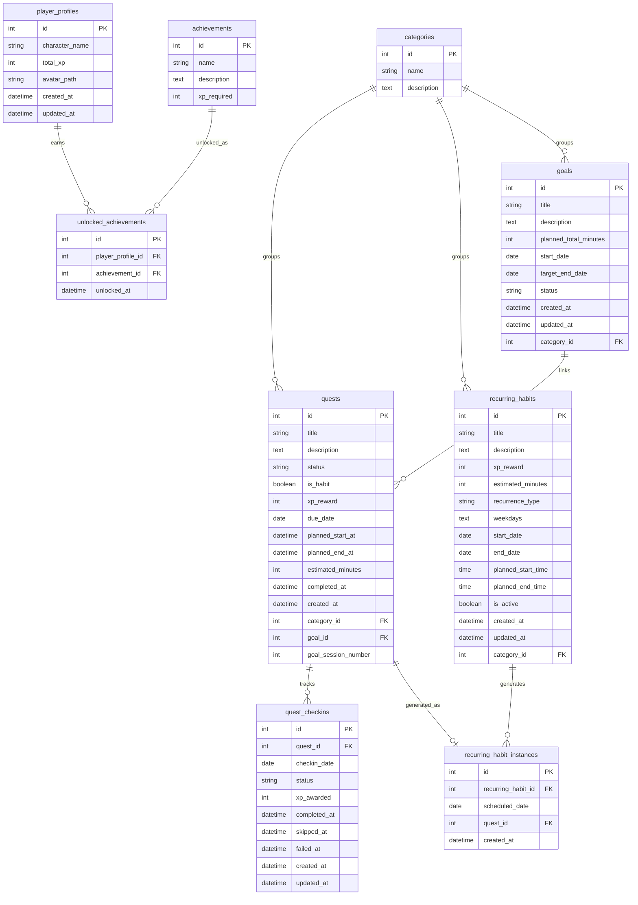

# Data Model

Habit Quest Analytics uses SQLite locally through SQLAlchemy. The model remains intentionally small, but daily status tracking now belongs to `QuestCheckin` rather than only to `Quest.status`.

## Source Of Truth

`QuestCheckin` is the main source of truth for daily completion/status/progression when check-ins exist.

- `Quest.status` still exists for legacy compatibility and fallback.
- New scheduled quests create a planned check-in for the scheduled date.
- Command Center, Habit Analytics, and Character Profile should prefer check-in data when available.
- Avoid double-counting legacy quest status and check-in status for the same workflow.

## Tables

### categories

Stores labels used to group quests.

| Field | Purpose |
| --- | --- |
| `id` | Primary key. |
| `name` | Unique category name, such as Health, Work, Learning, Home, or Social. |
| `description` | Optional explanation of what belongs in the category. |

Relationships:

- One category can have many quests.
- One category can have many recurring habit templates.
- One category can have many goals/projects.

### goals

Stores long-term goal/project definitions. One-time scheduled quests can link to
goals, and goal progress is derived from linked quest check-ins. Recurring
habits are not linked to goals in the current phase.

| Field | Purpose |
| --- | --- |
| `id` | Primary key. |
| `title` | Goal/project name shown to the user. |
| `description` | Optional detail. |
| `category_id` | Foreign key to `categories.id`. Current service/UI creation requires a category for goals/projects. |
| `planned_total_minutes` | Planned total effort. `0` means the user has not set a time target yet. |
| `start_date` | Optional start date. |
| `target_end_date` | Optional target completion date. |
| `status` | Goal state: `Active`, `Completed`, or `Archived`. |
| `created_at` | Timestamp set when the goal is created. |
| `updated_at` | Timestamp updated when the goal changes. |

Relationships:

- Many goals can belong to one category.
- One goal can have many linked one-time quest sessions.
- Goals do not award XP directly.
- Goal earned XP is derived from linked `QuestCheckin.xp_awarded` values.
- Bulk-planned goal sessions do not use a separate table; they are ordinary
  one-time `Quest` rows linked through `Quest.goal_id`.
- Goal/project creation rejects missing or unknown categories. The database
  column remains nullable for compatibility with older local data.

### quests

Stores scheduled task or habit plans represented as RPG quests.

| Field | Purpose |
| --- | --- |
| `id` | Primary key. |
| `title` | Quest name shown to the user. |
| `description` | Optional quest notes. |
| `status` | Legacy quest-level status. Retained for compatibility/fallback, not the primary daily status source when check-ins exist. |
| `is_habit` | Reserved habit flag. Recurring habit templates use `recurring_habits`; generated habit days can still be represented as normal quests. |
| `xp_reward` | XP value assigned to this quest plan. |
| `due_date` | Planned date for the quest. |
| `planned_start_at` | Optional scheduled start datetime for calendar planning. |
| `planned_end_at` | Optional scheduled end datetime for calendar planning. |
| `estimated_minutes` | Planned duration in minutes. |
| `completed_at` | Legacy completion timestamp for quest-level completion. |
| `created_at` | Timestamp set when the quest is created. |
| `category_id` | Optional foreign key to `categories.id`. |
| `goal_id` | Optional foreign key to `goals.id` for one-time goal/project sessions. |
| `goal_session_number` | Nullable stable per-goal session number. Non-goal and recurring generated quests keep this `NULL`. |

Relationships:

- Many quests can belong to one category.
- Many quests can optionally belong to one goal/project.
- One quest can have many daily check-ins.
- One generated recurring habit instance can point to one quest.
- Recurring generated quests keep `goal_id = NULL` in the current phase.
- Goal-linked one-time sessions receive automatic titles in the format
  `{Goal Title} Session {N}`.
- Goal-linked one-time sessions require a category.
- Goal session numbering is scoped per goal and uses `max(existing number) + 1`;
  deleted sessions are not renumbered.
- Goal Session Planner-generated quests follow the same numbering and title
  rules as individually added goal sessions.

Retention behavior:

- Unresolved one-time planned quests can be hard-deleted only when their
  check-ins are still `Planned`, have `xp_awarded = 0`, and have no resolved
  timestamps.
- Quests with completed, skipped, failed, or XP-awarded check-ins are preserved.
- Generated recurring quests follow recurring habit instance cleanup rules.

### quest_checkins

Stores daily completion records for quests.

| Field | Purpose |
| --- | --- |
| `id` | Primary key. |
| `quest_id` | Required foreign key to `quests.id`. |
| `checkin_date` | Date this quest check-in belongs to. |
| `status` | Daily state: `Planned`, `Completed`, `Skipped`, or `Failed`. |
| `xp_awarded` | XP awarded for this check-in. Defaults to `0`. |
| `actual_minutes` | Optional positive time recorded when this check-in is completed. |
| `completed_at` | Timestamp set when the check-in is completed. |
| `skipped_at` | Timestamp set when the check-in is skipped. |
| `failed_at` | Timestamp set when the check-in is failed. |
| `created_at` | Timestamp set when the check-in is created. |
| `updated_at` | Timestamp updated when the check-in changes. |

Constraints and relationships:

- Many check-ins belong to one quest.
- The pair `quest_id` and `checkin_date` is unique.
- Completed check-ins award XP once by storing the awarded value in `xp_awarded`.
- Skipped, failed, and planned check-ins should have `xp_awarded = 0`.
- `actual_minutes` is cleared when a check-in is skipped, failed, or reset to
  planned; it does not affect XP rewards.
- Completed, skipped, failed, and XP-awarded check-ins are historical records and
  are intentionally preserved by cleanup workflows.

### recurring_habits

Stores recurring habit templates. These templates are not completed directly;
explicit month generation creates normal planned quest days and planned
check-ins.

| Field | Purpose |
| --- | --- |
| `id` | Primary key. |
| `title` | Habit name shown to the user. |
| `description` | Optional notes. |
| `category_id` | Optional foreign key to `categories.id`, matching current quest category behavior. |
| `xp_reward` | Time-based XP value copied to generated quests. |
| `estimated_minutes` | Planned duration copied to generated quests. |
| `recurrence_type` | Recurrence type. v1 is designed around `selected_weekdays`. |
| `weekdays` | Serialized JSON weekday list for SQLite v1. `0` is Monday and `6` is Sunday. |
| `start_date` | First date the habit can generate. |
| `end_date` | Optional final date the habit can generate. |
| `planned_start_time` | Optional template start time for generated recurring quest days. |
| `planned_end_time` | Optional template end time for generated recurring quest days. |
| `is_active` | Whether the template should be eligible for future generation. |
| `created_at` | Timestamp set when the template is created. |
| `updated_at` | Timestamp updated when the template changes. |

Relationships:

- Many recurring habit templates can belong to one category.
- One recurring habit can have many generated instances.

Retention behavior:

- Templates with no generated instances can be hard-deleted.
- Templates with generated history are archived/deactivated with
  `is_active = False` instead of being hard-deleted.
- Archived/inactive templates remain available for historical joins but do not
  generate new planned days.

### recurring_habit_instances

Links one recurring habit template and scheduled date to one generated quest.

| Field | Purpose |
| --- | --- |
| `id` | Primary key. |
| `recurring_habit_id` | Required foreign key to `recurring_habits.id`. |
| `scheduled_date` | Date generated from the recurring habit template. |
| `quest_id` | Required foreign key to the generated `quests.id`. |
| `created_at` | Timestamp set when the instance is created. |

Constraints and relationships:

- The pair `recurring_habit_id` and `scheduled_date` is unique.
- `quest_id` is unique, so one generated quest belongs to at most one recurring habit instance.
- Many generated instances belong to one recurring habit.
- One generated instance points to one quest.
- Generated quests can then use existing `QuestCheckin` records for daily status and XP.

Safe cleanup behavior:

- Future generated instances can be removed only when the related scheduled
  `QuestCheckin` is still `Planned`, has `xp_awarded = 0`, and has no
  completed/skipped/failed timestamp.
- A single generated recurring occurrence can be removed under the same
  unresolved planned safety rule.
- Completed, skipped, failed, past historical records, and XP-awarded check-ins
  are preserved.
- If cleanup removes the only planned check-in for the generated quest, the
  generated quest can also be removed.

### player_profiles

Stores the local RPG-style character profile.

| Field | Purpose |
| --- | --- |
| `id` | Primary key. |
| `character_name` | Display name for the character. |
| `total_xp` | Legacy stored total XP field. Current profile calculations use check-in XP when check-ins exist. |
| `avatar_path` | Optional local path to the uploaded character avatar image. |
| `created_at` | Timestamp set when the profile is created. |
| `updated_at` | Timestamp updated when the profile changes. |

Relationships:

- One player profile can have many unlocked achievements.

### achievements

Stores achievement definitions.

| Field | Purpose |
| --- | --- |
| `id` | Primary key. |
| `name` | Unique achievement name. |
| `description` | Optional explanation of the achievement. |
| `xp_required` | XP threshold associated with the achievement. |

Relationships:

- One achievement can be unlocked by many profiles through `unlocked_achievements`.

### unlocked_achievements

Links player profiles to achievements they have unlocked.

| Field | Purpose |
| --- | --- |
| `id` | Primary key. |
| `player_profile_id` | Foreign key to `player_profiles.id`. |
| `achievement_id` | Foreign key to `achievements.id`. |
| `unlocked_at` | Timestamp set when the achievement is unlocked. |

Relationships:

- Many unlocked achievement records belong to one player profile.
- Many unlocked achievement records point to one achievement.
- The pair `player_profile_id` and `achievement_id` is unique.

## Mermaid ERD

## SQLite Startup Schema Helpers

The app currently uses lightweight idempotent SQLite schema helpers instead of a full migration framework.

Startup can:

- create missing tables through SQLAlchemy metadata,
- create `quest_checkins` for existing local databases if the table is missing,
- create `goals` for existing local databases if the table is missing,
- create `recurring_habits` and `recurring_habit_instances` for existing local databases if the tables are missing,
- add missing `estimated_minutes`, `planned_start_at`, and `planned_end_at` columns to `quests`,
- add missing `goal_id` to `quests`,
- add missing `goal_session_number` to `quests`,
- add missing `avatar_path` to `player_profiles`.

These helpers do not drop existing data.

## Category To RPG Stat Mapping

Character Profile stat XP is grouped from completed check-ins through the parent
quest category.

| Category | RPG stat |
| --- | --- |
| Health | Strength |
| Work | Discipline |
| Learning | Knowledge |
| Home | Recovery |
| Social | Creativity |

The radar chart displays calculated stat levels, not raw XP.

## Notes For Future Development

- `estimated_minutes` stores planned workload; `QuestCheckin.actual_minutes`
  stores optional recorded time for completed work.
- Achievement rules may need fields beyond `xp_required` once non-XP achievements are added.
- A production deployment with users should use a production database and a real migration strategy.
- Local avatar uploads are stored under `data/uploads/` and are intentionally ignored by git.
- On Streamlit Community Cloud, local SQLite and file storage may not persist across reboots, redeploys, or instance resets.
